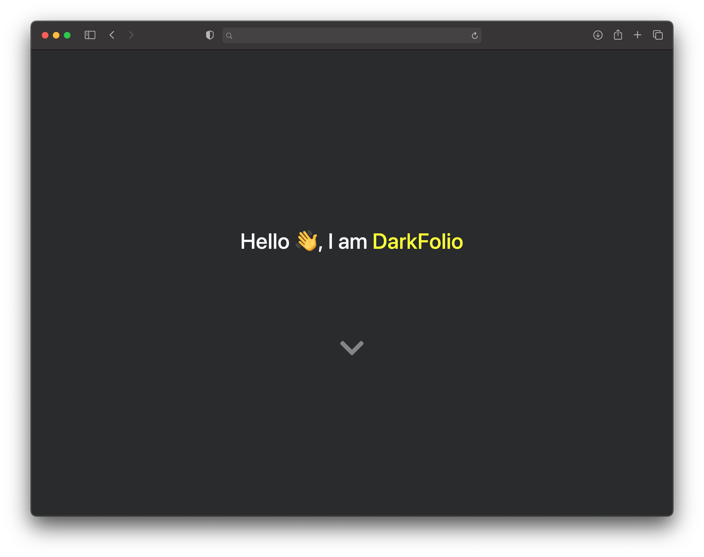

# Portfolio Theme

#### [live demo](https://onlyaviv.com/DarkFolio)
---
[](https://badge.fury.io/rb/DarkFolio)
## Installing DarkFolio

### Option 1: Install From GitHub
1. Fork DarkFolio on the [github repo](https://github.com/OnlyAviv/DarkFolio)
2. Rename your new repo how you would like.
3. Download the repo using `git clone https://github.com/your username/repo name` [e.g. `git clone https://github.com/onlyaviv/DarkFolio`].

### Option 2: Install From bundler
- If you are installing this theme on a already setup site, skip step 1
1. run `jekyll new site_name`, replaceing `site_name` with the site name.
2. Open the `_config.yml` file in the newly generated folder.
3. Add the following line anywhere in the `_config.yml` file
```yaml
theme: DarkFolio
```
4. Run `bundle` in the terminal from within the directory

## Editing the `_config.yml` file
Below is the data we will go over. If this is not in your `_config.yml` file, it is OK.
```yaml
  title:
  author:
  avatar:
  name_color:
  baseurl:
  email:

  about:
  description: >

  projects:
    -
    -
    -

  social_links:
    github:

  permalink: /:title/
```

The `title` variable is for the title of your page.

The `author` variable is for the author of your page, you can also put a project name here.

The `avatar` is the image to display on the main page.

The `name_color` is the color of the author's name.

The `baseurl` is the path to the site, if you are running this at `http://www.example.com/DarkFolio`, `baseurl` would be `DarkFolio`. if you are running this at the root of your page, like `http://www.example.com`, don't include `baseurl` in your `_config.yml`

The `email` is optional, as it is not used yet.

The `about` is for a few sentences about you or the project. you can use HTML elements in it like `<br>` or `<strong>`.

The `description` is if you want to put your site on google. It would be the little bit of text shown.

---


#### `Projects`

  For each project you have, you add the following to the projects
    ```js
    -  { name: "Project", repo: "Project Repo", image: "Project Image", website: "Website", package: "Package", details: "Description" }
    ```
    The `name`,`repo`,`image`, and `details` are all required. `name` is the name of the project, `repo` is the repo, [e.g https://github.com/username/repo]. `image` is the image display for your repo, and `details` is a small paragraph about your project.

  The optional parameters, `website` and `package` are for your projects homepage and package [e.g. https://npmjs.com/package/your_package_name].

---

`github within social_links` is for your github username, if you want, you can use a repo by putting `username/repo` as `github`

`permalink` is not for modification.

---


## Creating Posts
To create a post, add a file to the `_posts` directory named `YYYY-MM-DD-TITLE.md`, `YYYY-MM-DD` is the date. `Y` is year, `M` is month, and `D` is day. The `TITLE` is just for the path. Set it something short, like `Welcome`, or something long like `Did-you-know-that-when-you-put-1-and-1-together-it-makes-2`.

Within the file, add the following to the top:
```yaml
---
layout: post
title:
description:
image:
---
```
The `title` is the displayed title for the post.
The `description` is a small summary about the project.
The `image` is the display image.
The `layout` is not for modification.

Below the `yaml` added to the top, you can add your post content using markdown.
